# 🍃 WasteTrack+: AI-Powered Waste Classification & Reuse Marketplace

WasteTrack+ is a next-generation, AI-powered circular economy platform designed to automate waste classification, evaluate environmental safety, and provide custom upcycling/reuse recommendations. By connecting citizens, NGOs, and recycling facilities, WasteTrack+ gamifies eco-responsibility through a structured reputation and points system.

---

## 🚀 Key Features

* **AI-Powered Classification:** Uses Google Gemini to instantly identify waste categories (e.g., Paper, Plastic, Metal, Organic, Glass, Hazardous) from uploaded images.
* **Smart Upcycling Engine:** Generates tailored, step-by-step reuse ideas and safe disposal instructions based on the classified material.
* **Deterministic Safety Filter:** Runs a local versioned rule engine to flag hazardous, toxic, or regulated items immediately before AI processing.
* **Verification Workflow:** Enables NGOs and Recyclers to upload licenses and permits for manual administrative approval.
* **Transactional Security:** Enforces full database consistency (via Django transactions) across registration, consent logging, and verification stages.
* **Gamified Eco-System:** Tracks user contributions via an **Eco-Score** (reward points cache) and a dynamic **Reputation Score** (0.00 to 5.00).

---

## 🛠 Tech Stack

### Backend Infrastructure
* **Framework:** Django 5.0 & Django REST Framework (DRF)
* **Database:** PostgreSQL (supports Neon serverless Postgres and PostGIS spatial queries)
* **Auth:** JSON Web Tokens (JWT) via Django SimpleJWT (with secure token blacklisting)
* **API Documentation:** OpenAPI 3.0 schemas generated dynamically via `drf-spectacular`

### Asynchronous Tasks & Caching
* **Task Queue:** Celery 5.3+ (asynchronous classification pipelines and verification workflows)
* **Message Broker:** Redis 5.0+
* **Cache Backend:** Redis (with auto-fallback to local memory cache if Redis is offline)

### AI Integration
* **API:** Google Gemini API / Vertex AI (waste image recognition & safety audits)
* **Safety Circuit Breaker:** Implements a failsafe safety audit fallback when remote services are down.

### Frontend
* **Design System:** Responsive, dark-themed Glassmorphism UI built with Vanilla CSS3 variables.
* **Logic:** Vanilla ES6 JavaScript utilizing native Fetch API, client-side SHA-256 integrity hashing, and JWT session caching in local storage.

### DevOps & Deployment
* **Containerization:** Docker & docker-compose configurations
* **Production Gateway:** Gunicorn WSGI HTTP server
* **Static Assets:** WhiteNoise compressed static storage
* **Deployment Target:** Render Cloud Platform

---

## 📊 Process Flow & Architecture

The diagram below illustrates how registration, image uploading, and the AI classification pipeline coordinate across the client, API, database, and background workers:

```mermaid
sequenceDiagram
    autonumber
    actor User as Citizen / NGO
    participant Frontend as Browser UI
    participant Backend as Django API
    participant DB as Postgres (Neon)
    participant Broker as Celery (Redis)
    participant AI as Gemini API

    %% Registration & Consent
    Note over User, DB: 1. Authentication & Registration
    User->>Frontend: Enter details & Accept Privacy Consent
    Frontend->>Backend: POST /api/v1/auth/register/
    rect rgb(20, 30, 20)
        Backend->>DB: Write User, Profile, & UserConsentLog (Atomic Transaction)
    end
    DB-->>Backend: Success
    Backend-->>Frontend: JWT Access & Refresh Tokens
    Frontend->>User: Dashboard Access Granted

    %% Classification Pipeline
    Note over User, AI: 2. Waste Classification Pipeline
    User->>Frontend: Upload Waste Item Image
    Frontend->>Frontend: Compute client-side SHA-256
    Frontend->>Backend: POST /api/v1/classification/signed-url/ (Request signed GCS link)
    Backend-->>Frontend: Returns GCS Signed Upload URL
    Frontend->>Frontend: Directly upload image file to Cloud Storage
    Frontend->>Backend: POST /api/v1/classification/submit/ (Submit image_url & SHA-256)
    rect rgb(20, 30, 40)
        Backend->>DB: Create WasteItem (Status: ANALYZING)
        Backend->>Broker: Enqueue Background Tasks (classification & safety_filter)
    end
    Backend-->>Frontend: Task ID Received (Polling starts)

    %% Asynchronous Pipeline
    rect rgb(30, 30, 30)
        Broker->>Broker: Run Versioned Rule Engine (Local hazard checks)
        Broker->>AI: Call Gemini (Identify Category & Upcycling Guides)
        AI-->>Broker: Category, Disposal Instructions, & Reuse Ideas
        Broker->>DB: Save SafetyAssessment & update WasteItem (Status: CLASSIFIED)
    end

    Frontend->>Backend: GET /api/v1/classification/status/{id}/ (Poll)
    Backend-->>Frontend: Return Classified Results
    Frontend->>User: Display category, gauge score, upcycling guides, & safety badge
```

## 🌐 Production Deployment (Render)
THE APP IS LIVE AT - https://waste-to-best.onrender.com
   - `DEBUG=False`
   - `SECRET_KEY=your_production_secret`
   - `DATABASE_URL=your_neon_postgres_url`
   - `REDIS_URL=your_render_redis_url`
3. Static files are automatically handled via Gunicorn and WhiteNoise compression on startup (`python manage.py collectstatic --noinput` is run by `start.sh`).
